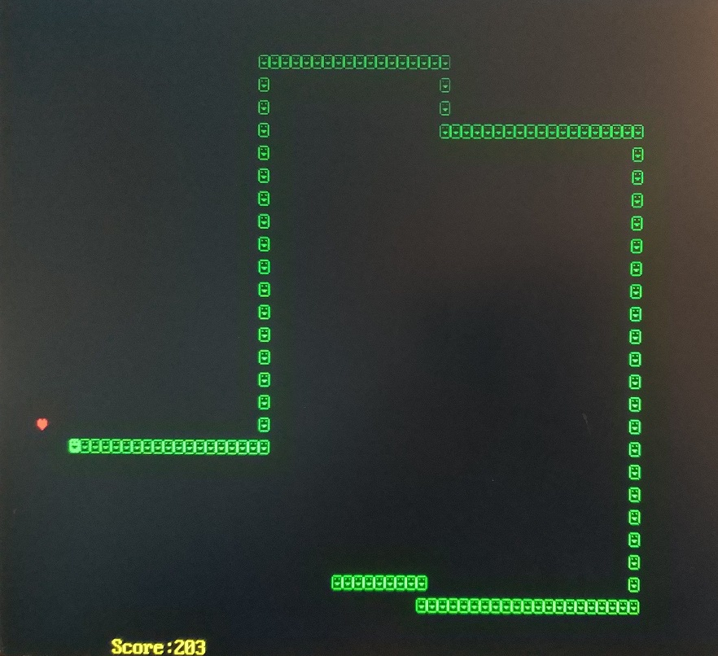

# Text-mode Snake game

## Resources

[INTEL&reg; FPGAS RESOURCE CENTER](https://www.intel.com/content/www/us/en/products/programmable/fpga/new-to-fpgas/resource-center/getting-started.html)  
[NANDLAND Tutorial - Introduction to VHDL](https://www.nandland.com/vhdl/tutorials/tutorial-introduction-to-vhdl-for-beginners.html)  

## Additional information

[VGA Signal Timing](http://tinyvga.com/vga-timing)  
[Introduce the VGA video standard](http://www.eng.ucy.ac.cy/theocharides/Courses/ECE664/VGA.pdf)  
[The Logic Space] https://www.digikey.com/eewiki/display/LOGIC/Home

## Harware 
FPGA Cyclone IV EP4CE10F17C8  
PS/2 keyboard   
640x480 16-bit RGB video (80x30 Text mode)   

##### Pin assigments

| Signal   |      Pin      |
|----------|--------------:|
| clk | PIN_E1 |  
| key | PIN_M16 |  
| rst | PIN_M15 |
| | |
| vgaB[4] | PIN_R3 |  
| vgaB[3] | PIN_N5 |  
| vgaB[2] | PIN_R4 |  
| vgaB[1] | PIN_T3 |  
| vgaB[0] | PIN_R6 |  
| | |
| vgaG[5] | PIN_P2 |  
| vgaG[4] | PIN_P1 |  
| vgaG[3] | PIN_T2 |  
| vgaG[2] | PIN_R1 |  
| vgaG[1] | PIN_P3 |  
| vgaG[0] | PIN_N3 |  
|         |        |
| vgaR[4] | PIN_K5 |  
| vgaR[3] | PIN_L2 |  
| vgaR[2] | PIN_L1 |  
| vgaR[1] | PIN_N2 |  
| vgaR[0] | PIN_N1 |  
| | |
| vgaHs | PIN_M10 |  
| vgaVs | PIN_L7 |  

